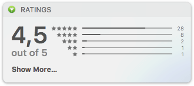
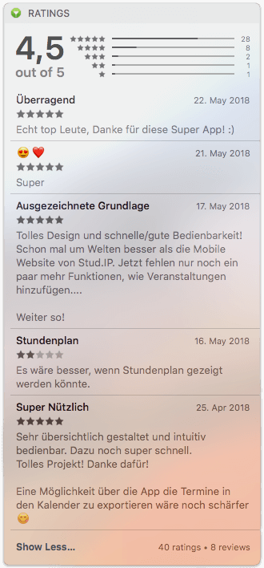

#  TodayConnect—Up-to-Date on App Reviews and Ratings

Do you like having to log into _iTunesconnect_ every time you want to take a peek at your app's ratings or check if there are any new reviews to answer? Me neither.

This is why I build a today widget for the _macOS_ notification center that allows you to do just that.

> **:construction: Warning**
>
> This is a just-for-fun weekend project—there are still many things to do and issues to fix (and documentation to write)! 

## Getting Started

1. [Download the latest release](https://github.com/stoeffn/TodayConnect/releases/tag/v0.1-1)
2. Log in with your Apple-ID
3. Enter your App-ID, which you can find under "App Information" in _iTunesconnect_

## Screenshots

